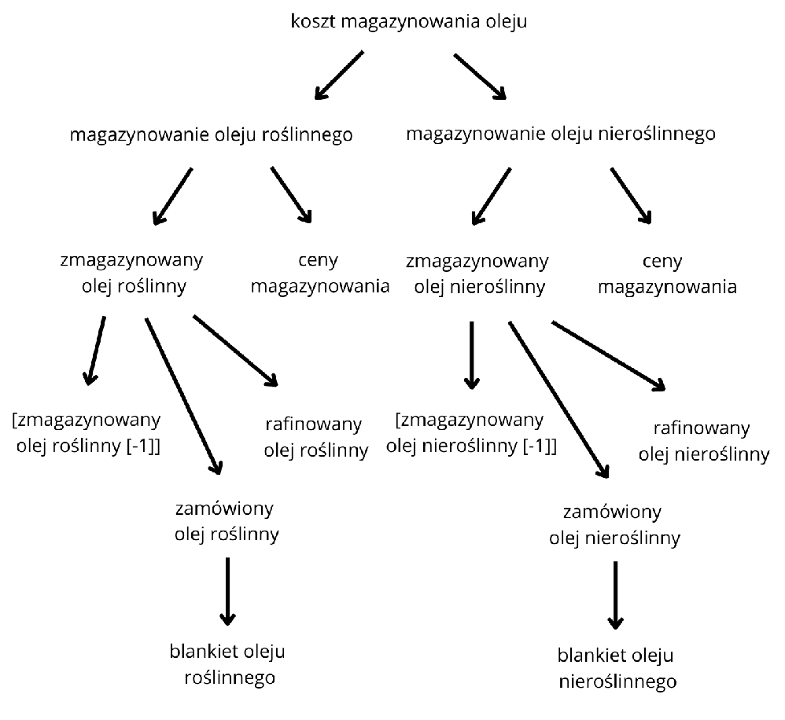
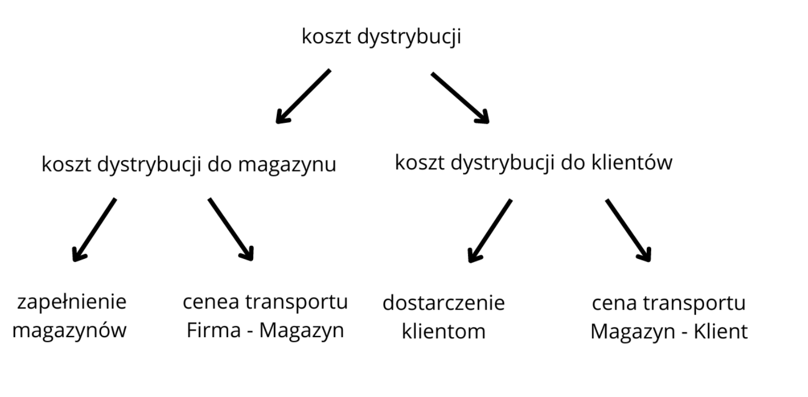

# **Etap 2**

## **Założenia**
- Mieszanie i twardość oleju roślinnnego - zmieniamy współczynniki, bo obecne są bez sensu (propozycja zmiany ograniczenia w nawiązanu do wymiany mailowej)
- Preferencje - klient zamawia tylko od tego dostawcy, na którym ma zdefiniowną preferencje 
- Zapotrzebowanie na towar - dowolny typ oleju, bez podziału na kategoie roślinny/nieroślinny, w fazie trasportu zostaje zagregowany do ogólnej masy urobku
- Ilość wysyłanego przez fabrykę towaru w danych modelowana empirycznie nie podlega ograniczeniu
---
## **Model programowania matemtycznego**
 

### **Funkcja celu**
$$ 

\LARGE\max_{zysk}
\hspace{3 mm} 
zysk
\hspace{3 mm} - \hspace{3 mm}  
koszt(x_{ZR}, c_{R}, x_{ZO}, c_{O}, x_{MR}, x_{MO}, c_{M}, x_{ZM}, c_{TM}, x_{DP}, c_{TK})

$$
$$

\LARGE zysk = c_{DP}\hspace{3 mm}*\hspace{3 mm}\sum_{m}{x_{DP}}

$$
$$

\LARGE koszt(x_{ZR}, c_{R}, x_{ZO}, c_{O}, x_{MR}, x_{MO}, c_{M}, x_{ZM}, c_{TM}, x_{DP}, c_{TK}) = [
x_{ZR} * c_{R} \hspace{3 mm} + \hspace{3 mm} x_{ZO} * c_{O}  
 \hspace{3 mm} + \hspace{3 mm}
 (\sum{x_{MR}} + \sum{x_{MO}}) * c_{M}
 \hspace{3 mm} + \hspace{3 mm}
 x_{ZM} * c_{TM}
 \hspace{3 mm} + \hspace{3 mm}
 x_{DP} * c_{TK}
]

$$

Poniżej znajdują się opisy zmiennych użytych w definicji funkcji celu:
| Nazwa zmiennej | Opis |
|:--------------:|:-----|
| $c_{DP}$ | cena dostarczanego produktu |
| $c_{R}$ | cena oleju roślinnego |
| $c_{O}$ | cena oleju nieroślinnego |
| $c_{M}$ | cena magazynowania surowca |
| $c_{TM}$ | cena transportu do magazynów |
| $c_{TK}$ | cena transportu do klientów |

 

### **Zmienne decyzyjne**

$$$$
| Nazwa zmiennej | Zależna od | Opis |
|:--------------:|:----------:|:-----|
| $x_{DP}$ | klientów, dostawcy, miesiąca dostarczania produktu | Dostarczony produkt do klientóww w danym miesiącu |
| $x_{ZR}$ | typu oleju roślinnego, miesiąca zakupu | Zakupiony olej roślinny (w tonach) |
| $x_{ZO}$ | typu oleju nieroślinnego, miesiąca zakupu | Zakupiony olej nieroślinny (w tonach) |
| $x_{MR}$ | typu oleju roślinnego, miesiąca zakupu | Zmagazynowany olej roślinny |
| $x_{MO}$ | typu oleju nieroślinnego, miesiąca zakupu | Zmagazynowany olej nieroślinny |
| $x_{ZM}$ | dostawcy, miesiąca | Zapełnienie magazynów |

 

 

### **Hierarchia zmiennych**
#### **Hierarchia zakupu oleju**

 

#### **Hierarchia magazynowania oleju**

#### **Hierarchia dsytrybucji oleju**

 

#### **Hierarchia zysku**

 

### **Ograniczenia**
 

> **Dla każdego miesiąca**
>
>$ x_{ZR} \leq 200 $
>
>$ x_{ZO} \leq 250 $
>
>$ x_{MR},\hspace{1 mm} x_{MO} \leq 1000 $

 

> **W czerwcu**
>
>$ x_{MR},\hspace{1 mm} x_{MO} \geq 500 $

 

> **Dla każdego magazynu/fabryki**
>
>$ x_{DP} \leq p_M $

 

> **Twardość**
>
>$ T_{max},\hspace{1 mm} \geq \ T_{O} * R_{O} $

 

> **Dla każdego klienta**
>
>$ x_{DP} \leq z_K $

 

>$ x_{DP},\hspace{1 mm} x_{ZR},\hspace{1 mm} x_{ZO},\hspace{1 mm} x_{MR},\hspace{1 mm} x_{MO},\hspace{1 mm} x_{ZM} \geq 0 $

 

Poniżej znajdują się opisy zmiennych użytych w ograniczeniach:
| Nazwa zmiennej | Opis |
|:--------------:|:-----|
| $p_M$ | Pojemność magazynu w danym miesiącu |
| $z_K$ | Zapotrzebowanie klienta |
| $T_{max}$ | Maksymalna twardość oleju |
| $T_{O}$ | Twardość oleju |
| $R_{O}$ | Rafinowana ilość oleju |